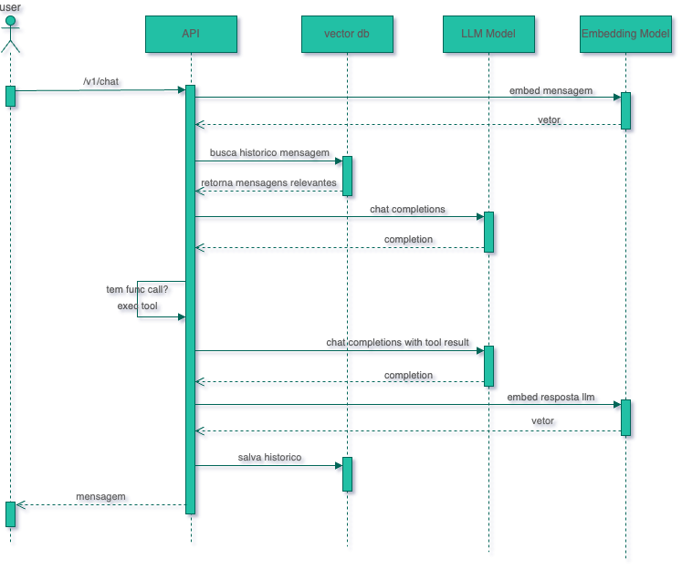

# Desafio turma Terabyte

Esse desafio consiste na implementação de uma API de chat com memória de conversa e pelo o menos uma tool que pode ser invocada pelo modelo.

## DORs

1. Explicar o desafio
2. Explicar o diagrama de sequencia
3. Ter pelo o menos uma linguagem de programacao disponível no computador para desenvolver o fluxo
4. Ter algum runtime de container (docker, podman, colima)
5. Ter a IDE recomendada para a linguagem escolhida

## DODs

1. Enviar o PR no github para o repositório base
2. Ter um vector DB para salvar o historico de mensagens
3. Recuperar o historico de mensagens no fluxo do chat
4. Ter pelo o menos 1 tool configurada para a LLM
5. Conseguir executar a tool durante o fluxo de chat
6. Ao citar alguma informacao do historico, a resposta deve conter isso

## Recomendações

Use a linguagem de programação que voce tiver mais dominio. A ideia do desafio é conseguir implementar com sucesso todos os requisitos. Não se preocupe em fazer um código bonito e muito estruturado. Vamos focar no bom e velho software funcionando

Todos os PRs feitos para o repositório base receberão um review até amanhão 23 de Maio de 2025 ao final do dia. Se voce não conseguir terminar hoje o desafio, voce tem até amanha a noite.

## BONUS!

Todos que acompanharem a aula online, receberão uma chave de API da OpenAI que será desativada no mesmo dia do desafio ao final do dia. Usem com moderação  e bom desafio!!!

# Diagrama

